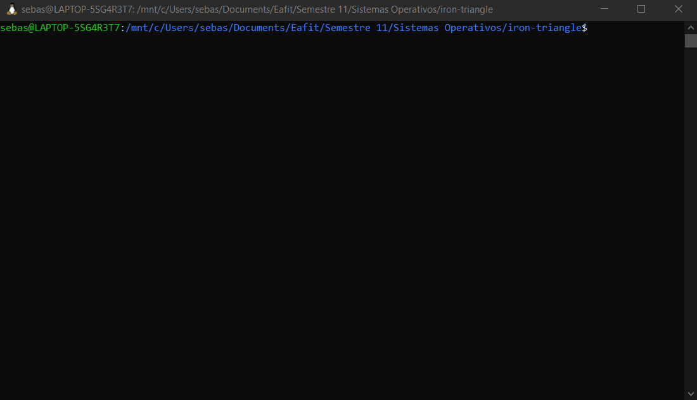

<div align="center">

# iron-triangle

Pipeline de compresión + encriptación en C puro para Linux.
Todo el procesamiento ocurre en RAM; una sola llamada `write()` toca el disco.



<br/>
<br/>

   

</div>

---

## Overview

iron-triangle implementa un pipeline `archivo → LZ77 compress → RC4 encrypt → disco` usando únicamente syscalls directas (`open`, `read`, `write`) sin librerías de compresión ni criptografía externas.

El orden compresión→encriptación es mandatorio: cifrar primero convierte los datos en ruido de máxima entropía, haciendo la compresión posterior matemáticamente imposible. Al comprimir primero, LZ77 explota la redundancia de los datos originales y RC4 protege el resultado compacto.

La clave se solicita con `getpass()`, se bloquea en RAM con `mlock()` para evitar que el kernel la mande al Swap, y se borra con `explicit_bzero()` inmediatamente tras inicializar el cifrador.

---

## Quick Start

**Requisitos:** gcc, Linux, python3, strace, `/usr/bin/time`

```bash
# Compilar
make

# Cifrar un archivo (pide contraseña en terminal)
./iron-triangle -e documento.txt documento.itec

# Recuperar el archivo original
./iron-triangle -d documento.itec recuperado.txt

# Verificar integridad
diff documento.txt recuperado.txt && echo "OK"

# Ejecutar tests y benchmark
make test
make benchmark
```

---

## Arquitectura

```
Entrada
  │
  ▼
read() × N          ← buffer de 4096 B (= página x86, alineado al page cache)
  │
  ▼
lz77_compress()     ← sliding window 4096 B · look-ahead 16 B · token 3 B
  │
  ▼
rc4_crypt()         ← KSA + PRGA in-place · clave borrada con explicit_bzero
  │
  ▼
write() × 1         ← resultado completo al disco en una sola syscall
  │
  ▼
Salida (.itec)
```

**Formato de archivo:**

| Magic  | Contenido              | Modo  |
|--------|------------------------|-------|
| `LZ77` | header 8B + tokens     | `-c`  |
| `ITEC` | header 8B + RC4(tokens)| `-e`  |

El header (magic + `original_size`) no se cifra: el decompressor lo necesita para el `malloc()` previo al descifrado.

---

## Estructura

```
iron-triangle/
├── src/
│   ├── main.c          # pipeline (-c / -e / -d) y detección de formato
│   ├── io.c / io.h     # read_file() y write_file() con syscalls directas
│   ├── lz77.c / lz77.h # compresor y descompresor LZ77 desde cero
│   └── rc4.c / rc4.h   # RC4 KSA+PRGA + get_key_secure()
├── tests/
│   └── test_roundtrip.sh
├── benchmark/
│   ├── benchmark.sh
│   └── results.txt
├── ANALYSIS.md         # tabla benchmark con números reales
├── SUSTENTACION.md     # respuestas a preguntas de defensa oral
└── Makefile
```

---

## Restricciones técnicas

| Parámetro | Valor | Razón |
|-----------|-------|-------|
| Buffer de I/O | 4096 B | Página x86 → alineado al TLB y al page cache |
| Sliding window | 4096 B | Un escaneo = una entrada TLB, sin TLB misses |
| Look-ahead | 15 B | 4 bits del token (0..15); valor máximo codificable |
| Token LZ77 | 3 B | `offset[12b] \| length[4b] \| literal[8b]` |
| Llamadas `write()` | 1 | El pipeline completo ocurre en RAM |
| Cifrado | RC4 | Stream cipher, sin padding, tamaño = tamaño comprimido |

---

## Créditos

Desarrollado por **Sebastian Salazar** — Sistemas Operativos, EAFIT 2026.

Profesor: Edison Valencia
---

## Licencia

Distribuido bajo la [MIT License](LICENSE).
